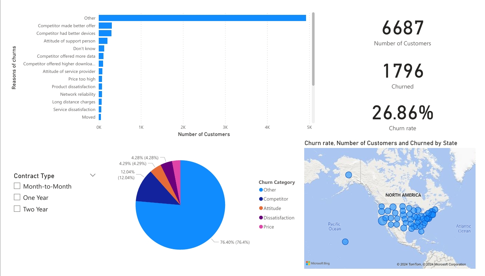
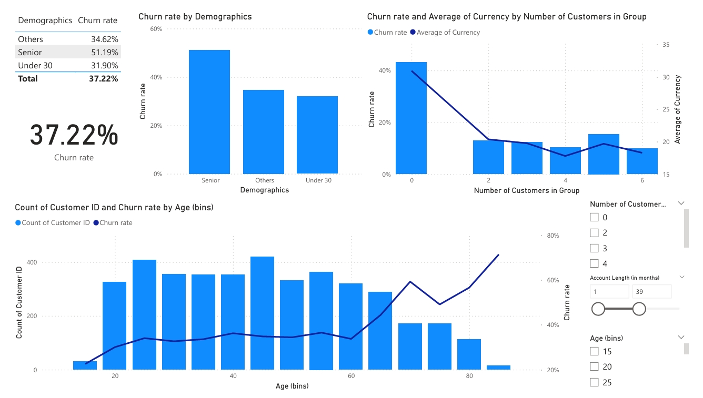
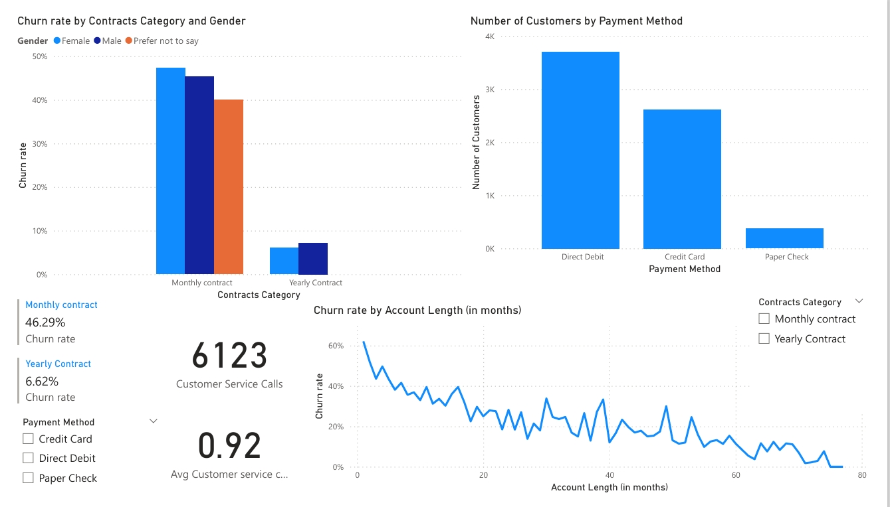
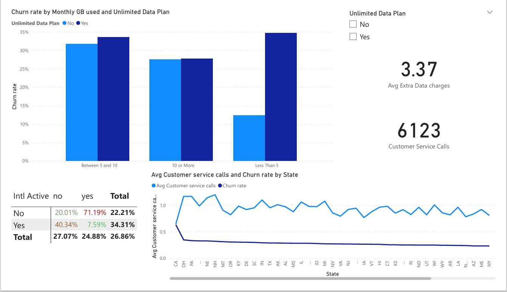

# Customer Churn Analysis Power BI

## Project Overview
This project is a comprehensive customer churn analysis using Power BI. The dashboard provides insights into different customer segments, exploring churn patterns and identifying factors contributing to customer attrition.

## Features
- **Data Cleaning and Preprocessing**
- **Analysis of Customer Churn Segments**
- **Interactive Visualizations** (e.g., KPI cards, bar charts, trend lines)
- **Insights** into churn drivers and customer behavior patterns

## Technologies Used
- **Power BI** (for analysis and visualization)
- **Power Query** (for data transformation)

## Usage
Instructions on how to download the `.pbix` file and view the dashboard.

## Dataset
This project uses an [Excel dataset](./customr_churn_dataset.csv) for analysis.

## Screenshots 
## Screenshots

### Data Check

### Age Grouping

### Contract Analysis

### Plans Analysis

